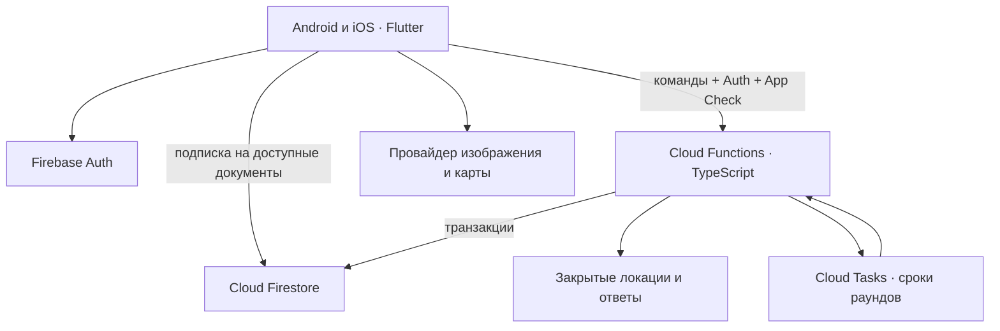

# Geographic Duel — дизайн и архитектура v0.1

Дата: 30 сентября 2026. Статус: проектное предложение и интерактивный визуальный прототип; приложение и Firebase ещё не развёрнуты.

## 1. Направление: светлый атлас

Подтверждённый стиль: спокойно, дорого, светло. География занимает главное место; интерфейс напоминает современный атлас и оптический прибор. Тёплая бумага, естественные цвета ландшафтов, хвойный акцент, аккуратная картографическая сетка. Стеклянные капсулы и круглые «линзы» располагаются над изображением и картой.

Собственный характер создают крупный глобус на главной, редакционная типографика, небольшие координатные подписи и раскрытие карты из круглой кнопки. Не использовать россыпь одинаковых карточек, фиолетово-синие градиенты, повсеместное свечение и декоративные значки без функции.

Стекло применяется к навигации, компасу и плавающим действиям. Основной текст и итог раунда имеют спокойную плотную подложку. Это следует подходу Apple: Liquid Glass формирует слой управления над содержимым. [Apple Materials](https://developer.apple.com/design/human-interface-guidelines/materials)

### Визуальные параметры

| Параметр | Решение |
|---|---|
| Бумага / основной текст | `#F4F3ED` / `#233D35` |
| Акцент / соперник | `#315E4C` / `#AD633E`; цвет всегда сопровождается именем или символом |
| Карта | Тёплая светлая вода, приглушённая зелёная суша, тонкие границы |
| Шрифт интерфейса | Системный: SF Pro на iOS, системный sans на Android |
| Крупные заголовки | Выразительный serif с кириллицей; в прототипе Georgia, финальный шрифт выбрать при переносе |
| Типографика | Заголовок главной 42–46; экран 28–32; основной текст 16–17; подпись 12–13 |
| Скругления | Капсула для действий; 28–32 для шторки; круг для компаса и коротких действий |
| Отступы | Шаг 4; поля экрана 24; минимум 12 между самостоятельными действиями |
| Стекло | Светлый край, мягкая тень, размытие 16–24; плотность растёт над пёстрым изображением |
| Движение | 220–320 мс; карта раскрывается вверх; результат рисует пути от ответов к цели |

Интерактивные области: минимум 44 pt на iOS, 48 dp на Android. Поддержать увеличение текста, VoiceOver/TalkBack, Reduce Motion, Reduce Transparency и повышенный контраст. Стекло получает плотную альтернативу. Результат читается без анимации и без различения цветов. Звук и вибрация отключаются отдельно.

### Экраны и переходы

1. **Вход:** короткое объяснение дуэли, Apple / Google; гостевой режим только для тренировки до привязки аккаунта.
2. **Главная:** глобус, выбранный режим, одно главное действие «Начать дуэль»; нижняя навигация: дуэль, рейтинг, профиль.
3. **Поиск:** отменяемое ожидание соперника; после назначения матча переход к загрузке.
4. **Раунд:** изображение на весь экран, запас здоровья обоих игроков, номер раунда и время; крупная кнопка карты.
5. **Ответ:** карта раскрывается снизу; панорама остаётся доступна; точку можно двигать до подтверждения. Действие недоступно без выбранной точки.
6. **Ожидание:** после подтверждения точка заблокирована; видно, что ответ принят. Ответ соперника и цель скрыты.
7. **Итог раунда:** правильная точка, две догадки, расстояния, очки, урон, оставшееся здоровье.
8. **Итог матча:** победитель, изменение рейтинга, краткий список раундов; новая дуэль / главная.
9. **Рейтинг и профиль:** компактные списки, история, аватар, настройки доступности.

Обязательные состояния реализации: поиск без пары, загрузка изображения, недоступная локация, потеря сети, восстановление матча, истечение времени, отклонённый поздний ответ, выход из матча. Проектировать рядом с основными экранами, не заменять универсальным сообщением «ошибка».

Прототип показывает главный экран, поиск, одну демонстрационную локацию, выбор на карте, итог раунда, рейтинг и профиль. Все игроки и показатели демонстрационные; реальный онлайн, полноценная 360°-панорама, пять уникальных раундов и авторизация в нём отсутствуют. Перемещение фотографии показывает поведение интерфейса, а не полноценную панорамную проекцию.

## 2. Клиент: выбор для MVP

**Рабочая рекомендация: Flutter для Android и iOS, Firebase на сервере.** Одна кодовая база позволяет согласованно развивать оба приложения. В Flutter стекло — собственный визуальный компонент; он не становится системным Liquid Glass автоматически. Возможности платформенной интеграции проверяются отдельным небольшим прототипом. [Архитектура Flutter](https://docs.flutter.dev/resources/architectural-overview)

Если требуется именно нативная оптика и морфинг Apple один в один, выбрать SwiftUI для iOS и отдельный интерфейс Android на Compose. Apple предоставляет `glassEffect` для SwiftUI; такой выбор требует сопровождения двух интерфейсов. На старых версиях iOS нужен fallback. Пока подтверждён визуальный стиль, а не обязательное использование нативного эффекта, поэтому два приложения преждевременно не закладываем. [Apple: custom Liquid Glass](https://developer.apple.com/documentation/SwiftUI/Applying-Liquid-Glass-to-custom-views)

Перед окончательным выбором клиента: проверить экран «изображение + живая карта + стеклянная шторка» на физическом iPhone и среднем Android. Цель — стабильные 60 кадров/с при перемещении карты; при просадках уменьшать площадь размытия. Веб-прототип не доказывает производительность мобильного приложения.

### Структура приложения

```text
app/                 запуск, маршруты, зависимости, тема
design_system/       GlassButton, GlassDock, HealthBar, MapSheet, RoundSummary
features/
  auth/              вход и привязка аккаунта
  lobby/             главная, выбор режима
  matchmaking/       поиск и отмена
  match/             состояние раунда, догадка, ожидание, результат
  profile/           профиль, история, настройки
  leaderboard/       рейтинг сезона
domain/              модели и состояния, без Firebase и виджетов
data/                Firebase-адаптеры, репозитории, DTO
location_viewer/      интерфейс PhotoViewer / PanoramaViewer
map_picker/           отдельный адаптер карты
```

Направление зависимостей: экран → контроллер состояния → репозиторий → Firebase. Модели предметной области независимы от отображения. Ключевые интерфейсы: `AuthRepository`, `MatchRepository`, `MatchmakingRepository`, `LocationViewer`, `MapPicker`. Поставщика изображения и поставщика карты можно менять независимо.

## 3. Сервер и данные



Сервер выбирает локацию, назначает времена, принимает ответы, считает расстояния, очки, здоровье и рейтинг. Клиент управляет просмотром, черновиком точки и отображением. Команда отправляется через callable-функцию; видимое состояние приходит по Firestore-подписке. Callable SDK передаёт доступные токены Auth/App Check, но права участника и входные данные функция проверяет сама. [Firebase callable](https://firebase.google.com/docs/functions/callable)

### Коллекции и доступ

| Путь | Содержание | Кто читает / пишет |
|---|---|---|
| `profiles/{uid}` | Имя, аватар, публичная статистика | Авторизованные читают; изменения имени через функцию |
| `accounts/{uid}` | Настройки и приватные данные | Только владелец; разрешённый набор настроек |
| `playerSessions/{uid}` | Текущий матч, состояние поиска | Владелец читает; сервер пишет |
| `matchmakingTickets/{uid}` | Регион, рейтинг, время входа, TTL | Только сервер |
| `matches/{id}` | Два участника, статус, здоровье, номер раунда, версия правил | Участники читают; сервер пишет |
| `matches/{id}/rounds/{n}` | Публичное состояние: идентификатор медиа, время, флаги готовности/ответа | Участники читают; сервер пишет |
| `matches/{id}/rounds/{n}/receipts/{uid}` | Собственный зафиксированный ответ и время принятия | Только этот участник читает; сервер пишет |
| `matches/{id}/results/{n}` | Цель, обе точки, расстояния, очки, урон | Создаётся после раскрытия; участники читают |
| `matchSecrets/{id}/rounds/{n}` | Истинные координаты и обе принятые догадки | Только сервер |
| `locationsPrivate/{id}` | Координаты, источник, права, версии медиа | Только сервер |
| `leaderboards/{season}/entries/{uid}` | Серверный рейтинг и публичные показатели | Авторизованные читают; сервер пишет |
| `matchSettlements/{id}` | Признак однократного изменения рейтинга | Только сервер |

В публичном документе нельзя прятать секретное поле с помощью правил: чтение Firestore относится к документу целиком. Поэтому секреты физически отделены. Admin SDK обходит клиентские Security Rules: вся проверка команд обязательна внутри функций. [Firestore: доступ к полям](https://firebase.google.com/docs/firestore/security/rules-fields)

`submitted=true` допустим до раскрытия; координаты соперника — нет. Подписываться на документ своего матча и текущего раунда, не на всю коллекцию. Для истории и рейтинга использовать страницы с курсором. Realtime Database для присутствия можно добавить позднее; онлайн-индикатор не определяет исход матча.

### Команды

| Команда | Основные проверки / действие |
|---|---|
| `joinQueue(requestId, region, mode)` | Один активный билет/матч на uid, ограничения частоты; рейтинг берётся с сервера |
| `cancelQueue(ticketId)` | Транзакция: отменить только ещё не назначенный билет; при состоявшемся подборе вернуть matchId |
| `markReady(matchId, roundId)` | Участник, правильная версия раунда, локация загружена; повторный вызов безопасен |
| `submitGuess(matchId, roundId, lat, lng, requestId)` | Auth, App Check, членство, конечные числа, диапазоны, статус, серверный срок; первая принятая точка окончательна |
| `forfeitMatch(matchId, requestId)` | Участник, матч активен; однократное завершение |
| `resolveRound(matchId, roundId)` | Только сервер; оба ответа или истёк срок, результат ещё не создан |

Повтор той же команды возвращает прежний результат. Попытка заменить уже принятый ответ отклоняется. Клиент показывает «Ответ принят» только после серверного подтверждения; при обрыве проверяет receipt. Локально сохранять черновик можно, автоматически отправлять его после срока нельзя.

### Подбор и конкурентный доступ

Для MVP — серверный подбор по режиму, региону и постепенно расширяемому диапазону рейтинга. Транзакция повторно проверяет оба билета и обе `playerSessions`, закрепляет пару и создаёт ровно один матч. Отмена, два одновременно работающих подборщика и повторный запрос должны конкурировать через те же документы. Просроченные билеты исключаются по времени, независимо от задержки очистки TTL. Нужен периодический worker для оставшихся билетов; не держать callable-запрос открытым в ожидании пары.

В Firestore транзакция может повторяться при конкурирующих изменениях. Случайную локацию выбирать до транзакции, а побочные эффекты — задачи, уведомления — выполнять идемпотентно после фиксации. Для надёжной постановки таймера писать outbox-событие в той же транзакции; повторяемый dispatcher создаёт задачу с детерминированным именем. [Firebase transactions](https://firebase.google.com/docs/firestore/manage-data/transactions)

### Жизненный цикл

```text
queued → matched → loading → active → revealed
                                ↑         ↓
                                └─ следующий раунд
                                          ↓
                                        finished
```

После `matched` оба клиента загружают одинаковый asset и сообщают готовность. Сервер назначает `startsAt` немного в будущем и `endsAt = startsAt + 60 секунд`. Предлагаемый лимит загрузки — 15 секунд. Ошибка медиа до старта отменяет рейтинговый матч без изменения рейтинга; повторные намеренные отмены требуют ограничения частоты.

Раунд закрывается, когда оба ответа приняты или истёк срок. Первый ответ не сокращает время второго в MVP. Серверный приём до `endsAt` определяет своевременность, время устройства не учитывается. Cloud Tasks запускает закрытие по сроку, но доставка может запаздывать: поздняя догадка всё равно отклоняется. Фоновая сверка подбирает зависшие активные раунды. [Cloud Tasks](https://firebase.google.com/docs/functions/task-functions)

Разрыв соединения после начала не ставит матч на паузу. При возврате клиент восстанавливает текущее состояние. Отсутствие ответа даёт 0 очков. После раскрытия — 5 секунд на результат и загрузка следующего раунда. Клиент может раньше закрыть результат, но сам следующий раунд не запускает.

## 4. Правила MVP — предложенные, требуют игрового теста

- 5 раундов максимум, 60 секунд на ответ, 6000 здоровья у каждого.
- Расстояние: формула haversine по WGS84-координатам, радиус сферы 6371.0088 км. Для игры достаточно; координаты и расстояния валидируются на сервере.
- Очки: `round(5000 × exp(−distanceKm / 1500))`. Нет ответа — 0.
- Урон: `abs(scoreA − scoreB)` проигравшему раунд; при равных очках урона нет. Здоровье не ниже нуля.
- При 0 здоровья матч заканчивается досрочно. После пятого раунда побеждает игрок с большим здоровьем; при равном здоровье — ничья.
- Рейтинг: серверный Elo, старт 1000, K=24 для первого теста; ничья имеет результат 0.5. Обновление обоих рейтингов и settlement — одна транзакция. Изменение только для рейтинговой дуэли.
- Версия правил фиксируется при создании матча; Remote Config может менять правила новых матчей, не активных.

Пример: 100 км ≈ 4678 очков, 1000 км ≈ 2567, урон ≈ 2111. Коэффициент 1500 и здоровье 6000 — параметры балансировки, не окончательный выбор.

## 5. Локации и карта — отдельное решение

Для первой играбельной версии разумно начать с лицензированных фотографий или собственных панорам фиксированной точки. `LocationViewer` позволяет позже подключить поставщика 360° без перестройки матча. В наборе должны быть права на использование, проверенная координата, нейтральный asset ID, версия и состояние доступности. У собственных файлов удалить EXIF/GPS и названия, выдающие место, в разрешённом процессе подготовки.

Провайдера карты и панорам окончательно выбирать после проверки покрытия нужных стран, SDK на обеих платформах, стоимости и разрешённого сценария. Для Google Street View использовать разрешённый API/SDK, сохранять обязательную атрибуцию и соблюдать ограничения хранения; правила Static API не заменяют условия других SDK. [Street View Static policies](https://developers.google.com/maps/documentation/streetview/policies)

Секреты в Firestore не обеспечивают абсолютную защиту от подсказок: панорамный SDK или идентификатор медиа может раскрывать географию клиенту; изображение допускает обратный поиск. Это нужно проверить до рейтингового режима. App Check снижает злоупотребление API, но не является полной защитой от читов. Для серьёзного рейтинга нужны наблюдение за аномалиями и отчётность по источникам контента.

## 6. Проверки перед реализацией и выпуском

1. Дизайн: пройти основной сценарий на 320–430 pt/dp, с большим текстом, на светлом и пёстром изображении; проверить контраст и доступность действий одной рукой.
2. Клиент: прототип стекла поверх выбранной карты и изображения на двух физических устройствах; замеры плавности и нагрева.
3. Firebase Emulator: посторонний не читает матч; участник не читает секреты; клиент не пишет здоровье/рейтинг; чужой receipt закрыт.
4. Сервер: два одновременных ответа, повторные команды и задачи, граница дедлайна, обрыв после записи, ничья, оба без ответа, выход, двойной подбор, гонка с отменой.
5. Контент: источник и права, точность координат, доступность двух клиентов, обязательная атрибуция, отсутствие случайной выдачи ответа.
6. Эксплуатация: раздельные dev/staging/prod, регион Functions рядом с Firestore, секреты на сервере, бюджетные оповещения, Crashlytics, метрики ошибок и задержки подбора. Оплата и внешние сервисы на этом этапе не включены.

## 7. Источники визуального прототипа

- Геометрия: [World Atlas 2 / Natural Earth](https://github.com/topojson/world-atlas), проекция d3-geo. Границы обзорные, не политическое утверждение и не навигационная карта.
- Изображение: [A-Frame panorama example](https://github.com/aframevr/aframe/tree/v1.7.1/examples/boilerplate/panorama). Используется как демонстрационная сцена; лицензию исходной фотографии отдельно проверить перед поставкой приложения.
- Демонстрационная точка: район Пюи-де-Санси, 45.52824 N, 2.81401 E, [источник координат](https://mapcarta.com/18298152). Это опорная точка прототипа, не подтверждённая GPS-точка съёмки.

## 8. Выполненная проверка прототипа

Проверен в Chromium при ширине окна 736 и 320 пикселей (в узком варианте доступная поверхность 288 пикселей). Горизонтального переполнения и ошибок JavaScript не обнаружено. Проверены открытие карты, ввод точки, масштабирование, подтверждение, ожидание и переход к результату, отмена поиска, профиль и уменьшение прозрачности. Фотография загружается; карта содержит 177 стран из опубликованной геометрии. Визуально просмотрены главная, сцена, выбор точки и результат.

Контрольный ответ 45.8 N / 3.4 E даёт около 55 км и 4821 очко; демонстрационный ответ соперника — около 678 км и 3182 очка; разница 1639 уменьшает здоровье соперника до 4361. Это локальный расчёт макета, не проверка серверной реализации. Проверки Firebase, мобильных сборок и физических устройств ещё предстоят.

Следующий результат разработки после согласования направления: окончательные мобильные макеты со всеми состояниями, небольшой технический прототип стекла/карты и затем вертикальный срез «два тестовых пользователя → один честно рассчитанный раунд».
